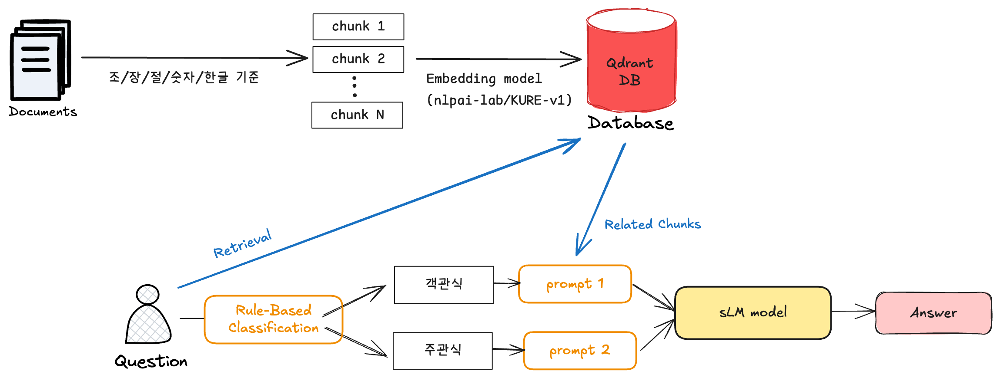

# 💳 2025 금융 AI Challenge : 금융 AI 모델 경쟁

## 📌 대회 개요
- **주최**: Dacon
- **대회 링크**: [Dacon Competition](https://dacon.io/competitions/official/236527/overview/description)
- **목표**: 금융보안 실무에 적합한 개발 방법론 및 AI 모델을 발굴
- **평가지표**: FSKU
- **분야 키워드**: 금융, 생성형 AI, LLM

<br>

## 📂 데이터 수집
>2025년 8월 1일 전(~2025.07.31)에 공식적으로 공개되었으며, 최소한 비상업적 이용이 허용된 라이선스(CC BY-NC, CC0, CC-BY-SA, CC-BY-NC-SA 등)로 배포된 외부 데이터만 사용할 수 있습니다. 해당 조건을 충족하지 않는 외부 데이터는 사용이 불가능합니다.\
-직접 수집한 데이터(예: 수기 작성, 자체 크롤링)는 사용할 수 없습니다. 외부 데이터는 반드시 공식적으로 공개되어 있으며, 라이선스가 명확하게 부여된 경우에만 사용 가능합니다.\
-데이터 증강은 허용되며, 코드 상 구현이 가능한 방식으로 사용해야 합니다. 단, 증강에 활용된 원천 데이터와 사용된 모델 역시 대회 규칙을 충족해야 합니다.

수집한 문서 출처
- [**법제처 국가법령정보센터**](https://www.law.go.kr/main.html)
- [**금융위원회**](https://www.fsc.go.kr/)

<br>

## 🧠 RAG 파이프라인


<br>

## 🧪 실험
### 1. Embedding
법률 문장에 대해 테스트를 했을 때, 토큰이 거의 차이가 없었다. 
가벼운 모델로 선정
- [v] [nlpai-lab/KURE-v1](https://huggingface.co/nlpai-lab/KURE-v1)
- nlpai-lab/KoE5
- intfloat/multilingual-e5-small
- BAAI/bge-m3

<br>

### 2. LLM
언어 모델도, 인프라 한계로 인해 가벼운 모델로 선정
- llama3.1:8b-instruct-q2_K
- qwen3:4b-instruct
- [v] kakaocorp/kanana-nano-2.1b-base

<br>

## 📊 평가
- 객관식 점수 : 정확도
- 주관식 점수 : 0.6 X 의미 유사도 + 0.4 X 키워드 재현율 기반 혼합 점수
    - 의미 유사도(Cosine Similarity): 예측 문장과 정답 문장 간의 OpenAI 임베딩(text-embedding-3-small) 기반 코사인 유사도
    - 키워드 재현율(Keyword Recall): 정답 키워드 중 예측 문장에 등장한 키워드 비율
- Score = 0.5 x 객관식 점수 + 0.5 x 주관식 점수

    ```python
    public score 0.57914
    private score 0.57551
    ```

<br>


## ✨ 인사이트
- Mac pro 16GB에서 무리없이 작동하는 로컬 모델은 많지 않다. (4b 돌릴때도 무리였음)
- 데이터 수집이 가장 중요하다고 생각했다.

<br>

## 🏆 대회 성과 (개인 참가)
Private Leaderboard Score  `0.57551`